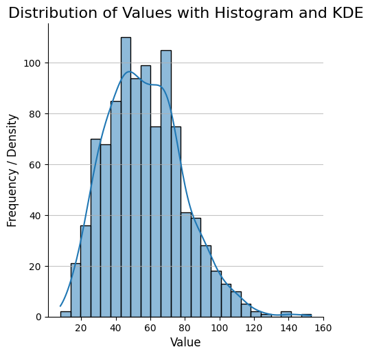
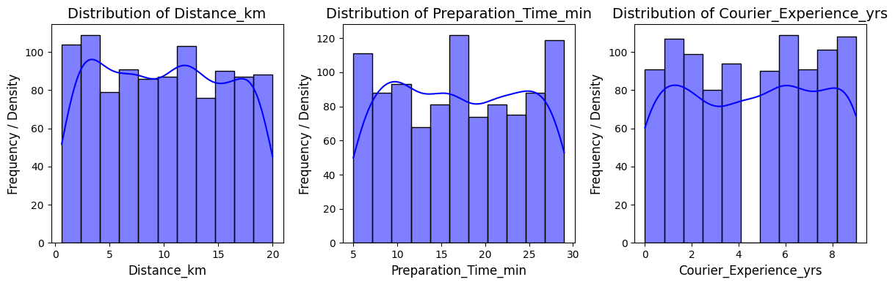
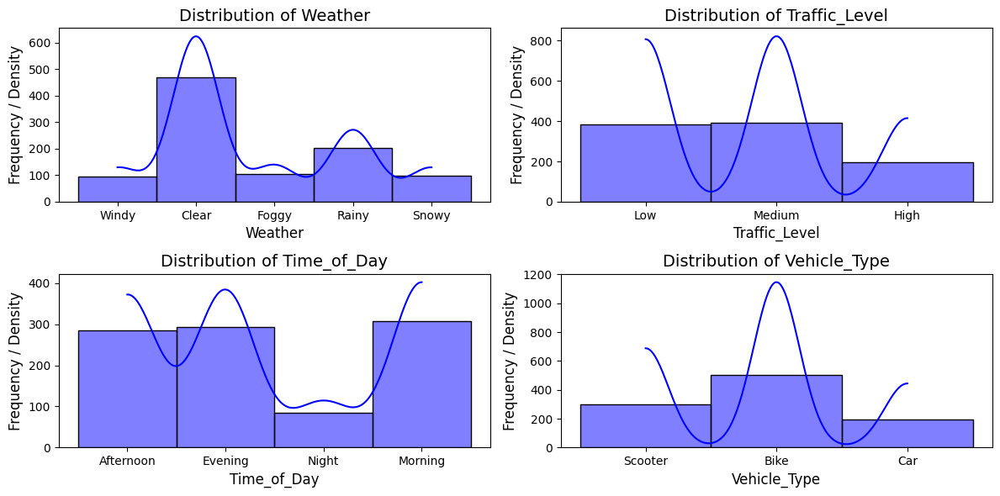
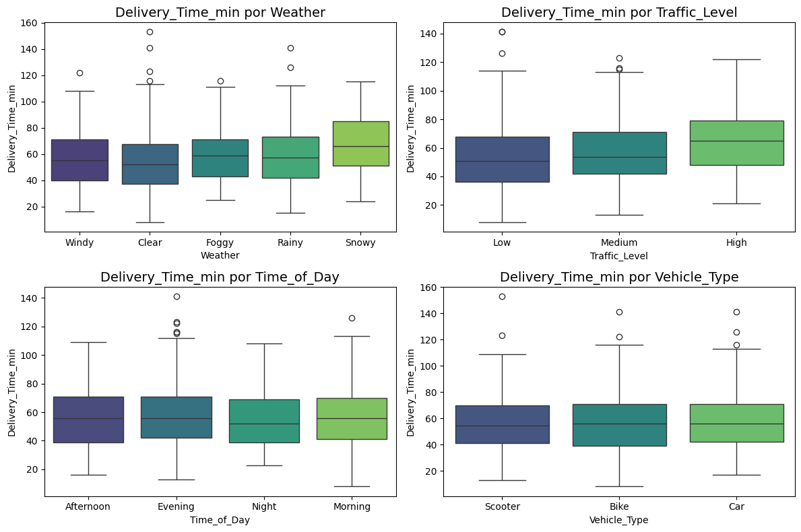

# Exploratory Data Analysis (EDA) Report

## 1. Executive Summary
This Exploratory Data Analysis (EDA) of the food delivery platform dataset aims to uncover key patterns, identify potential issues, and understand the factors influencing delivery times. The analysis reveals that delivery distance, preparation time, weather conditions, and traffic levels are the primary drivers of delivery duration. While no extreme outliers were found in numerical features except for a few in the target variable, missing values were identified in `Weather`, `Traffic_Level`, `Time_of_Da`y, and `Courier_Experience_yrs`, which will require imputation during preprocessing. The overall data quality is good, providing a solid foundation for predictive modeling.

## 2. Data Quality & Preprocessing Notes
### 2.1. Missing Values
```
Order_ID                  0
Distance_km               0
Weather                  30
Traffic_Level            30
Time_of_Day              30
Vehicle_Type              0
Preparation_Time_min      0
Courier_Experience_yrs   30
Delivery_Time_min         0
```
- **Observation**: A total of 30 missing values are present in `Weather`, `Traffic_Level`, `Time_of_Day`, and `Courier_Experience_yrs`.

- **Action for Preprocessing**: These missing values will need to be addressed. For categorical features (Weather, Traffic_Level, Time_of_Day), strategies like mode imputation or treating 'NaN' as a separate category will be considered. For Courier_Experience_yrs, mean/median imputation or a more sophisticated method will be evaluated. Given the small number of missing values (30 out of presumably a larger dataset), their impact on the overall distribution might be minimal, but imputation is necessary.

### 2.2. Data Types
```
Order_ID                  int64
Distance_km             float64
Weather                  object
Traffic_Level            object
Time_of_Day              object
Vehicle_Type             object
Preparation_Time_min      int64
Courier_Experience_yrs  float64
Delivery_Time_min         int64
```
- **Observation**: Data types are appropriate for each variable. Numerical features are int64 or float64, and categorical features are object. No type conversion issues are immediately apparent.

### 2.3. Consistency
Checking unique values for categorical columns:
```
--> Weather
['Windy' 'Clear' 'Foggy' 'Rainy' 'Snowy' nan]
--> Traffic_Level
['Low' 'Medium' 'High' nan]
--> Time_of_Day
['Afternoon' 'Evening' 'Night' 'Morning' nan]
--> Vehicle_Type
['Scooter' 'Bike' 'Car']
```
- **Observation:** The categories within each feature are consistent, with no typos or multiple representations of the same category. The presence of nan confirms the missing values observed earlier.

## 3. Analysis of Key Variables
### 3.1. Delivery_Time_min (Target Variable)

- **Distribution**: The target variable Delivery_Time_min exhibits a right-skewed distribution, with the majority of delivery times concentrated between approximately 40 and 80 minutes. There's a tail extending towards higher delivery times, indicating some longer deliveries.
- **Range**: Delivery times range from around 10 minutes up to approximately 150 minutes, which is a reasonable spread for food delivery.

### 3.2. Numerical Variables

- **Distance_km**: The distribution of `Distance_km` appears relatively uniform across its range (0 to 20 km), with slight peaks around 2-5 km and 10-12 km. This suggests deliveries are spread across various distances.

- **Preparation_Time_min**: `Preparation_Time_min` shows a somewhat bimodal distribution, with peaks around 10-12 minutes and 25-28 minutes. This might indicate different preparation efficiencies or types of orders/restaurants.

- **Courier_Experience_yrs**: `Courier_Experience_yrs` also appears relatively uniformly distributed across experience levels (0 to 9 years), suggesting a mix of new and experienced couriers.

### 3.3. Categorical Variables

- **Distributions**:
    - `Weather`: 'Clear' is the most frequent weather condition, followed by 'Rainy' and 'Foggy', with 'Windy' and 'Snowy' being less common.
    - `Traffic_Level`: 'Low' and 'Medium' traffic levels are more frequent than 'High' traffic.
    - `Time_of_Day`: 'Evening' and 'Morning' appear to be the most frequent times of delivery, with 'Afternoon' and 'Night' having similar, slightly lower frequencies.
    - `Vehicle_Type`: 'Bike' is the most used vehicle type, followed by 'Scooter' and 'Car', indicating a preference for more agile vehicles, possibly due to urban environments.


- **Impact on `Delivery_Time_min`**:
    - `Weather`: Box plots clearly show that 'Rainy' and especially 'Snowy' conditions lead to significantly higher median delivery times and wider spreads (more variability) compared to 'Clear' or 'Windy' days. 'Foggy' also tends to increase delivery times.
    - `Traffic_Level`: As expected, Delivery_Time_min steadily increases with Traffic_Level. 'High' traffic levels result in considerably longer median delivery times, indicating greater variability in delivery durations.
    - `Time_of_Day`: The box plots show minimal differences in median Delivery_Time_min across Time_of_Day categories, suggesting that its direct impact on median delivery time might be less pronounced than Weather or Traffic.
    - `Vehicle_Type`: Similarly, Vehicle_Type shows relatively similar median delivery times across 'Scooter', 'Bike', and 'Car'. While there might be subtle differences in performance based on distance or traffic, the overall median is not dramatically affected by vehicle type alone.

## 4. Correlations and Dependencies
### 4.1. Numeric Variables vs Target Variable
```
Distance_km               0.780998
Preparation_Time_min      0.307350
Courier_Experience_yrs   -0.090433
```
- `Distance_km`: Shows a strong positive correlation (0.78), indicating that longer distances significantly increase delivery time. This is a primary driver.
- `Preparation_Time_min`: Has a moderate positive correlation (0.31), meaning longer preparation times also contribute to longer overall delivery times.
- `Courier_Experience_yrs`: Exhibits a very weak negative correlation (-0.09), suggesting that more experienced couriers might slightly reduce delivery times, but this effect is minimal compared to other factors.

### 4.2. Categorical Variables vs Target Variable
```
Variable: Weather -> p-valor: 0.0000 (Significant) | η²: 0.0402
Variable: Traffic_Level -> p-valor: 0.0000 (Significant) | η²: 0.0384
Variable: Time_of_Day -> p-valor: 0.7765 | η²: 0.0011
Variable: Vehicle_Type -> p-valor: 0.5549 | η²: 0.0012
```
- **ANOVA Test (p-value)**:
    - `Weather` and `Traffic_Level` show statistically significant p-values (0.0000), confirming that the means of `Delivery_Time_min` are significantly different across their respective categories. This aligns with the observations from the box plots.
    - `Time_of_Day` and `Vehicle_Type` have high p-values (0.7765 and 0.5549 respectively), indicating that the differences in `Delivery_Time_min` means across their categories are not statistically significant. This supports the visual insights from the box plots that these factors have a minor direct impact on average delivery time.
- **Correlation Ratio**:
    - η² quantifies the strength of the relationship between a categorical variable and a numerical variable.
    - `Weather` (η²: 0.0402) and `Traffic_Level` (η²: 0.0384) show a moderate association with `Delivery_Time_min`, reinforcing their importance as predictors.
    - `Time_of_Day` (η²: 0.0011) and `Vehicle_Type` (η²: 0.0012) exhibit a very weak association, further confirming their limited individual explanatory power for delivery time.

## 5. Outliers and Anomalies
```
Column 'Distance_km': No outliers detected (IQR)
Column 'Preparation_Time_min': No outliers detected (IQR)
Column 'Courier_Experience_yrs': No outliers detected (IQR)
Column 'Delivery_Time_min': 6 outliers detected (IQR)
  Outlier Values: [123, 141, 153, 141, 126, 122]
  Bounds: [-4.00, 116.00]
```
- Observation: No outliers were detected in Distance_km, Preparation_Time_min, or Courier_Experience_yrs using the IQR method.

- Delivery_Time_min: Six outliers were identified in the target variable, with values ranging from 122 to 153 minutes, exceeding the upper bound of 116 minutes.

- Assumption/Action: These outliers represent exceptionally long delivery times. While they are outside the typical range, they might represent legitimate, albeit rare, events. Given their small number, they are unlikely to severely skew model training, and keeping them might help the model learn to predict rare, long delays.

## 6. Key Assumptions
- The provided dataset is representative of the platform's operational conditions across various urban regions.

- `Delivery_Time_min` encompasses the entire duration from order placement to customer receipt.

- The categorical labels are sufficiently granular to capture the impact on delivery times.