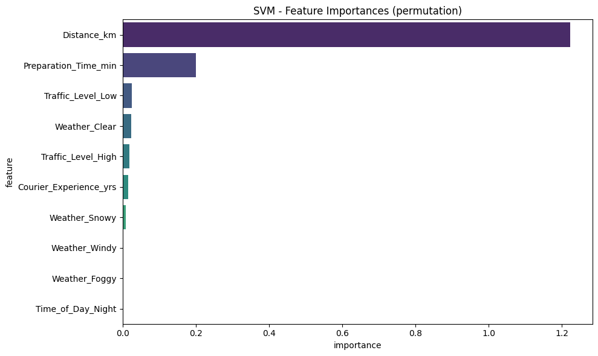
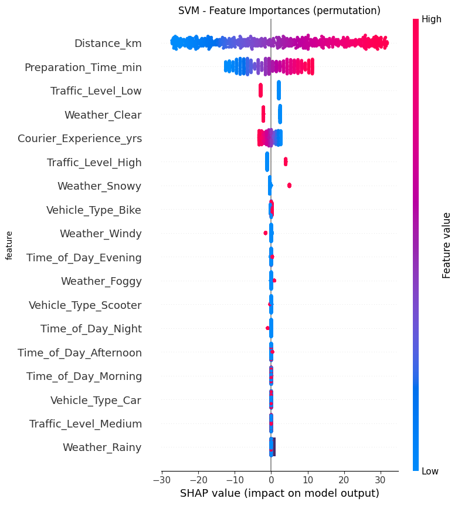

# Explainability Report: Insights from Feature Importance

Understanding which features contribute most to our model's predictions is crucial for building trust, debugging, and potentially deriving business insights. This section details the findings from permutation feature importance and SHAP analysis for our selected Support Vector Regressor (SVM) model.

## 1. Permutation Feature Importance
Permutation Feature Importance is a model-agnostic technique that measures the importance of a feature by calculating the increase in the model's prediction error after permuting (shuffling) the feature's values. A large increase in error indicates that the feature is important.

### 1.1. Methodology
For the SVM model, permutation importance was calculated by:
- Randomly shuffling the values of a single feature.
- Measuring the decrease in model performance (increase in MAE) after the shuffle.
- Repeating this process multiple times (`n_repeats`=10) to get a robust estimate and averaging the results.

### 1.2. Results
The top features by permutation importance are presented below and visualized in **SVM - Feature Importances (Permutation)**.

- `Distance_km`: This feature is overwhelmingly the most important predictor of `Delivery_Time_min`. Its importance score is significantly higher than any other feature, indicating that changes in delivery distance have the largest impact on predicted delivery time. This aligns perfectly with intuition longer distances naturally lead to longer delivery times.
- `Preparation_Time_min`: Following `Distance_km`, `Preparation_Time_min` is the second most important feature. This is also highly intuitive, as the time spent preparing an order directly adds to the total delivery time.
- `Traffic_Level_Low` **and** `Traffic_Level_High`: These one hot encoded features for traffic level show moderate importance. Interestingly, both 'Low' and 'High' traffic levels appear important. This suggests the model relies on these indicators to adjust predictions based on optimal (low traffic) and suboptimal (high traffic) conditions. The absence of `Traffic_Level_Medium` implies it might be the baseline or less impactful.
- `Weather_Clear`: The presence of 'Clear' weather as an important feature suggests that the absence of adverse weather conditions provides a baseline for faster deliveries.
- `Courier_Experience_yrs`: This feature has a relatively low, but non-negligible, importance. While its direct correlation was weak in the EDA, the model still uses it to make nuanced adjustments to the predictions.
- **Other Categorical Features**: Features like `Weather_Snowy`, `Weather_Windy`, `Weather_Foggy`, and various `Time_of_Day` categories show very low permutation importance. This implies that while they might influence delivery times, their individual contribution to the model's overall prediction power, when varied, is minimal compared to distance, preparation time, and major traffic/weather indicators.

## 2. SHAP Analysis
SHAP values offer a unified approach to explain the output of any machine learning model. They represent the contribution of each feature to the prediction for an individual instance, explaining how to go from the base value (average model output) to the model's output for that instance. A SHAP summary plot provides an aggregated view of feature importance and directional impact.

## 2.1. Methodology
Since SVM is not a tree based model, `shap.KernelExplainer` was used, which is model-agnostic and estimates SHAP values by approximating the model locally with a linear model. A sample of 100 instances from the training data (`shap.sample(X_train, 100)`) was used to compute the SHAP values.

## 2.2. Results
The SHAP summary plot is presented in **SHAP Summary Plot for SVM**.

- `Distance_km`: Confirms its paramount importance.
    - **High `Distance_km` (red dots to the right)**: Consistently leads to higher predicted `Delivery_Time_min` (positive SHAP values).
    - **Low `Distance_km` (blue dots to the left)**: Consistently leads to lower predicted `Delivery_Time_min` (negative SHAP values).
    - The wide spread of SHAP values for `Distance_km` further underscores its dominant influence.
- `Preparation_Time_min`: Also strongly impacts predictions.
    - **High `Preparation_Time_min` (red dots to the right)**: Increases predicted delivery time.
    - **Low `Preparation_Time_min` (blue dots to the left)**: Decreases predicted delivery time.
- `Traffic_Level_Low`:
    - **Presence of 'Low' traffic (high feature value, red dots to the left)**: Tends to decrease predicted delivery time (negative SHAP values), which is logical.
- `Weather_Clear`:
    - **Presence of 'Clear' weather (high feature value, red dots to the left)**: Tends to decrease predicted delivery time.
- `Courier_Experience_yrs`:
    - **High courier experience (red dots to the left)**: Tends to slightly decrease predicted delivery time (negative SHAP values). This aligns with the weak negative correlation observed in the EDA.
    - **Low courier experience (blue dots to the right)**: Tends to slightly increase predicted delivery time.
- `Traffic_Level_High`:
    - **Presence of 'High' traffic (high feature value, red dots to the right)**: Tends to increase predicted delivery time.
- **Other Features (`Weather_Snowy`, `Vehicle_Type_Bike`, `Time_of_Day_Evening`, etc.):** These features have SHAP values clustered very close to zero, indicating that their impact on individual predictions is minimal compared to the top features. This confirms the findings from the permutation importance plot and the ANOVA/Correlation Ratio in the EDA. For instance, `Weather_Rainy` despite being logically important, shows very low impact perhaps due to less variance in the dataset for this category or its effect being implicitly captured by traffic.

## 3. Conclusion on Feature Importance
Both Permutation Feature Importance and SHAP analysis consistently highlight:

1. `Distance_km` and `Preparation_Time_min` are the most critical drivers of delivery time predictions. These features should be prioritized for data quality and collection accuracy.
2. Traffic conditions (`Traffic_Level_Low`, `Traffic_Level_High`) and `Weather_Clear` are also important factors, indicating that environmental and situational variables play a significant role.
3. `Courier_Experience_yrs` has a minor but noticeable impact, with more experienced couriers generally associated with faster deliveries.
4. Other categorical features like `Time_of_Day` and `Vehicle_Type`, while part of the model, have a negligible impact on its predictions.

These insights are valuable for not only understanding the model but also for business stakeholders to focus on operational improvements (optimizing routes to minimize distance, streamlining preparation processes, and considering traffic/weather impacts on dispatching).