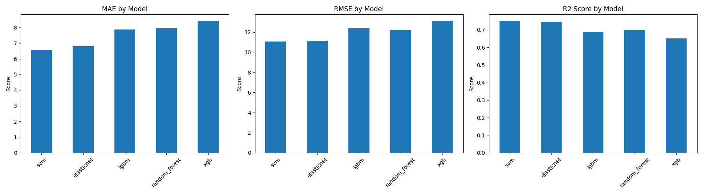

# Model Notes
## 1. Modeling Logic and Algorithm Selection
The primary objective is to predict `Delivery_Time_min`, which is a continuous numerical variable. Therefore, this project is framed as a regression problem. Our modeling strategy is centered around building a robust and accurate predictive model that can capture the complex relationships between various input features and the delivery time.

### 1.1. Chosen Algorithms for Evaluation
To identify the best-performing model for this task, a diverse set of regression algorithms were considered and evaluated:

1. **ElasticNet Regression**: A linear model that combines L1 (Lasso) and L2 (Ridge) regularization. It's good for feature selection and handling multicollinearity, providing a balance between simplicity and performance.
2. **Random Forest Regressor**: An ensemble learning method that constructs a multitude of decision trees during training. It's known for its high accuracy, robustness to outliers, and ability to handle non-linear relationships and feature interactions. It also naturally provides feature importance.
3. **Support Vector Regressor (SVR)**: A powerful and flexible algorithm that can model linear and non linear relationships. It works by finding a hyperplane that best fits the data while allowing for a certain margin of error.
4. **Light Gradient Boosting Machine (LGBMRegressor):** A gradient boosting framework that uses tree based learning algorithms. It's highly efficient, fast, especially with large datasets. It builds trees by growing leaves first, leading to faster training.
5. **XGBoost Regressor (XGBRegressor):** Another highly optimized gradient boosting library known for its speed and performance. It's widely used in Kaggle competitions and production environments due to its strong predictive power and various regularization techniques.

The selection covers a spectrum from simpler linear models to more complex ensemble and kernel based methods, allowing for a comprehensive comparison to find the optimal balance of performance and efficiency.

## 2. Metric Choice
For evaluating the performance of our regression models, we selected three key metrics, with a particular emphasis on Mean Absolute Error (MAE) for its business interpretability:

### 1. Mean Absolute Error (MAE):
- MAE measures the average magnitude of the errors in a set of predictions, without considering their direction. It is in the same units as the target variable, making it highly intuitive and directly interpretable for business stakeholders. An MAE of 5 minutes means, on average, our prediction is off by 5 minutes. This direct understanding is crucial for operational decision making.
### 2. Root Mean Squared Error (RMSE):
- RMSE is the square root of the average of the squared errors. It penalizes large errors more heavily than MAE due to the squaring term. This is important if larger discrepancies in delivery time predictions are disproportionately more costly or damaging to customer satisfaction than smaller ones. Like MAE, it is also in the same unit as the target variable.
### 3. R-squared (R2):
- R2 represents the proportion of the variance in the dependent variable that is predictable from the independent variables. A value of 1 indicates that the model explains all the variability of the target variable, while 0 indicates no variability explained. It provides a general measure of how well the model fits the data.

**Prioritization**: MAE is the primary metric for model selection and communication due to its direct interpretability. RMSE will be used as a secondary metric to ensure large errors are sufficiently penalized, and R2 will provide an overall goodness of fit indication.

## 3. Tuning Approach
To achieve optimal performance for each selected model, hyperparameter tuning was performed using Optuna, a powerful open source hyperparameter optimization framework.

### 3.1. Optuna Hyperparameter Optimization
- **Methodology**: Optuna was used to perform an efficient search over the hyperparameter space for each model. It employs a TPE (Tree-structured Parzen Estimator) sampler by default, which intelligently prunes unpromising trials and samples new parameters based on the performance of past trials. This is more efficient than exhaustive Grid Search or purely random Random Search.
- **Objective Function**: The objective function for Optuna was designed to minimize the Mean Absolute Error. This aligns with our primary evaluation metric.
- **Cross Validation**: For each combination of hyperparameters, 5 Fold was used. This ensures that the evaluation of each hyperparameter set is robust and less susceptible to the specific train-test split, providing a more reliable estimate of the model's true performance. The `cross_val_score` function with `make_scorer(mean_absolute_error)` was employed.
- **Hyperparameter Search Space**:
    - **ElasticNet**: `alpha` (L1/L2 regularization strength, log-uniform from 1e-4 to 10.0), l1_ratio (mix of L1/L2, uniform from 0.0 to 1.0).
    - **Random Forest Regressor**: `n_estimators` (number of trees, integer from 100 to 1000), `max_depth` (maximum depth of each tree, integer from 3 to 30).
    - **SVR**: `C` (regularization parameter, log-uniform from 0.1 to 100.0),`epsilon` (epsilon-tube within which no penalty is associated, log uniform from 0.01 to 1.0), `kernel` (kernel type, categorical: "linear", "rbf").
    - **XGBoost Regressor**: `n_estimators`, `max_depth`, `learning_rate` (step size shrinkage, uniform from 0.01 to 0.3).
    - **LGBM Regressor**: `n_estimators`, `max_depth`, `learning_rate`.

### 3.2. Best Model Selection
After 50 trials, Optuna identifies the best performing model (and its parameters) based on the minimized MAE. The `best_model_scores` and `best_model_params` dictionaries were used to store the best MAE and corresponding parameters for each model type explored during the Optuna study.

## 4. Model Comparison and Final Selection
The cross validated metrics for the best-tuned version of each model were calculated and are summarized below:

|Model |MAE| RMSE| R2|
|-|-|-|-|
|svm| 6.555660 |11.079068| 0.749516 |
|elasticnet |6.816580| 11.143921| 0.746532|
|lgbm |7.521328 |11.989178 |0.707240|
|random_forest| 7.959909|12.230629 |0.694270|
|xgb |8.220183 |12.738030 |0.669616|

These results are also visually represented in Model Comparison Metrics.

**Model Comparison Metrics**
- **MAE by Model**: As shown in left plot, the SVM model achieved the lowest Mean Absolute Error of approximately 6.56 minutes. This indicates that, on average, its predictions are closest to the actual delivery times. ElasticNet is a close second.
- **RMSE by Model**: Similar to MAE (middle plot), SVM also boasts the lowest RMSE, approximately 11.08 minutes, implying it handles larger prediction errors more effectively than other models.
- **R2 Score by Model**: The R2 score (right plot) also shows SVM with the highest value (0.75), indicating that it explains the largest proportion of variance in Delivery_Time_min.

**Final Model Selection**: Based on these comprehensive evaluation metrics, the **Support Vector Regressor (SVM)** model, with its optimized hyperparameters, is selected as the best performing model for predicting delivery times. It consistently outperforms other models across MAE, RMSE, and R2, making it the most suitable choice for this task.

## 5. Considerations for Overfitting
During the tuning process with Optuna and cross-validation, the risk of overfitting was mitigated by:
- **Cross-Validation**: Evaluating models on multiple folds of the training data helps ensure the model generalizes well to unseen data within the training set.
- **Hyperparameter Constraints**: Hyperparameters like `max_depth` and regularization parameters (`alpha`, `l1_ratio`, `C`) were included in the search space. Optuna automatically seeks to find a balance between model complexity and performance, which helps prevent excessive overfitting.
- **Separate Test Set**: The final evaluation on an unseen test set (after model selection and tuning) will be the ultimate check for generalization ability.

This rigorous approach ensures that the chosen model is not only accurate but also robust and reliable for deployment in a production environment.